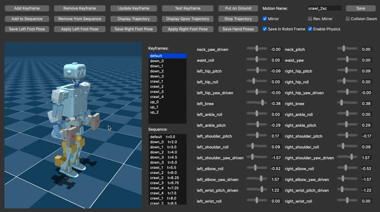

# Changelog

Notable changes to ToddlerBot are documented here.

## [2.0.0] - 2025-08-25

[Link to our X Post](https://x.com/HaochenShi74/status/1960130228480872683)

### **New Capabilities**

The GIFs are large and might take some time to load.

#### Cartwheel: Dynamic acrobatic movements 
<!--  -->

#### Crawl: Crawl like a toddler
<!--  -->

#### Enhanced Walking: Improved speed and stability
<!--  -->

#### VR Teleoperation: Real-time teleop via Meta Quest 
<!--  -->

#### Depth Perception: Foundation stereo 
<!--  -->

#### Hardware Robustness
We'll be honest: with naive DeepMimic and domain randomization, the success rate is still low. But the good news is that Toddy is extremely robust—it almost never breaks. Even if it breaks, it is super easy to fix.

<!--  -->

#### Keyframe App

We add many features to the keyframe app to make motion editing easy.
<!--  -->

### **Hardware Design**

#### Dual Design Support
  - `toddlerbot_2xc`: Same motors as v1.0.0
  - `toddlerbot_2xm`: Upgraded hip and arm motors

#### OnShape CAD
  - Streamlined sketches and feature minimization
  - Configuration-based parts and assemblies
  - Accurate weight distribution including fasteners and cables
  - Unified coordinate system alignment
  - Improved component naming

#### Head
  - Enhanced eye socket depth for camera protection

#### Torso
  - Optimized chest plate clearance

#### Pelvis
  - Optional metal bevel gears (will open-source if anyone is interested)
  - Anti-flex support structure

#### Arm
  - Reinforced structures for impact resistance (hammer-tested)
  - Reduced gear transmission friction
  - Simplified assembly process
  - Y-axis DoF alignment
  - Improved elbow-torso clearance

#### Leg
  - 30mm shorter for enhanced stability
  - Dual hip motor options (2XC430 or 2XM430-W350)
  - Temperature-resistant hip yaw link
  - Simplified knee design (removed parallel links)
  - Bearing-based motor idlers
  - Human-like foot geometry
  - Anti-slip rubber grips
  - Easier assembly

#### Calibration Device
  - Enhanced locking for every joint except knees (knees auto-stop at zero)

#### Communication Board
  - Eliminates U2D2
  - Integrated with power board
  - 8 USB ports for computer communication

#### Miscellaneous
  - Pre-applied thread locker fasteners
  - Detailed 3D printing profiles in our [MakerWorld release](https://makerworld.com/en/models/1733983)

### **Actuation**
#### Enhanced Motor System ID
  - Custom motor test bed (will open-source if anyone is interested)
  - Comprehensive parameter analysis (braking torque, kd, passive/active ratios)
  - Details in [paper](https://arxiv.org/abs/2502.00893) Section 8.10

#### C++ Dynamixel Control Rewrite
  - Migrated from Python to high-performance C++ with Python bindings
  - Control frequency: 50Hz → **200Hz**
  - Enhanced error handling and diagnostics
  - Multi-channel motor support

### **Sensing**
#### Foundation Stereo Depth
  - Enhanced camera calibration and rectification
  - TensorRT acceleration (10Hz on Jetson Orin NX)
  - Example script is `test_foundation_stereo.py`
  - See [toddlerbot/depth/README.md](toddlerbot/depth/README.md)

#### IMU
  - Consistent sensor streaming via `report_interval`
  - Threaded sensor reading

### **Robot Descriptions**
#### OnShape to MJCF Pipeline Rewrite
  - Updated `onshape_to_robot` integration
  - Self-contained robot configuration folders
  - Python-based conversion scripts
  - URDF and MJCF support
  - Organized XML structure with default classes
  - Finetuned the collision geoms for each link
  - Streamlined mesh and asset management
#### Layered Configuration System
  - Three-tier hierarchy: `default.yml` (global), `robot.yml` (robot-specific), `motors.yml` (instance-specific, git-ignored)

### **Motion Library**
#### Expanded Motion Library
  - Cartwheel motions
  - Crawling motions
  - More stable ZMP walking
  - Migration tools

#### Motion Reference Class
  - Unified keyframe and retargeted motion support

### **Keyframe App**
- Real-time viewport updates during slider interaction
- Collision geometry visualization toggle
- Contact point markers (orange)
- Interruptible trajectory testing
- Center of mass visualization (white sphere)
- Editable keyframe/sequence info (double-click)
- Drag-and-drop keyframe reordering
- Velocity logging during testing
- Torso-frame data storage (default): `body_pos`, `body_quat`, `site_pos`, `site_quat`, `body_in_vel`, `body_ang_vel`
- Optional global-frame storage
- Foot pose and hand marker features
- Physics-free qpos interpolation
- Stable test initialization
- Custom scene loading (`--scene` argument)

### **Simulation & Training**
#### Dual RL Framework Support
  - Default PPO pipeline uses rsl_rl with Brax compatibility wrappers
  - Removed Brax submodule (uses standard version)
  - Keep supporting Brax

#### DeepMimic
  - Full [DeepMimic](https://xbpeng.github.io/projects/DeepMimic/index.html) RL training support
  - Crawling and cartwheel trained with this pipeline

#### Terrain Generation System
  - Modular system under `sim/terrain/`
  - Six terrain types: flat, bumps, rough, slope, stairs, boxes
  - Perlin noise and heightmap utilities
  - MJX environment integration
  - Configurable tiles, resolution, spawn points
  - Example scripts: `test_terrain.py`, `test_terrain_mjx.py`

#### IMU Modeling
  - AR(1) colored noise simulation
  - Domain randomization for noise parameters

#### Additional Features
  - Randomized initial robot states
  - Reward scale curriculum
  - Default ONNX export for faster inference
  - Organized wandb logging

### **VR Teleoperation**
  - Meta Quest device support (tested on Quest 2)
  - Real-time IK motion retargeting
  - Hand and neck tracking with fixed base
  - Python communication interface
  - See [toddlerbot/manipulation/teleoperation/toddy_ar/README.md](toddlerbot/manipulation/teleoperation/toddy_ar/README.md)

### **Real world & Deployment**
#### Observation System
  - Removed Python thread pool
  - Added motor current sensing

#### Evaluation Tools
  - Enhanced sim2real analysis tools
  - Automated wandb checkpoint/log management

### **Acknowledgement**
Thanks to our team members (alphabetical orders) for making this possible! 

[Yao He](https://shockwavehe.github.io/), [Kaizhe Hu](https://hukz18.github.io/), [Jiacheng Hu](https://www.linkedin.com/in/jc-hu/), [Songbo Hu](https://hsb0508.github.io/), [Daniel Jiang](https://www.linkedin.com/in/danieljiangdj/), [Ken Wang](http://me.weizhuowang.com/), [Tae Hoon Yang](https://tae-h-yang.github.io/), [Zhicong Zhang](https://www.linkedin.com/in/zhicongzhang/)

---

## Migration Guide from 1.0 to 2.0

1. Order parts per [BOM](https://hshi74.github.io/toddlerbot/hardware/01_bill_of_materials.html) and new communication board based on the instructions [here](https://hshi74.github.io/toddlerbot/hardware/02_pcb8ch.html)
2. Re-print all parts except torso and head based on our [MakerWorld release](https://makerworld.com/en/models/1733983)
3. Follow updated [assembly instructions](https://hshi74.github.io/toddlerbot/hardware/04_assembly_manual.html)
4. Reinstall conda environment based on instructions [here](https://hshi74.github.io/toddlerbot/software/01_setup.html)
5. Ready to use! Please don't hesitate to let us know if there are any problems! The most recommended way is to post a GitHub issue