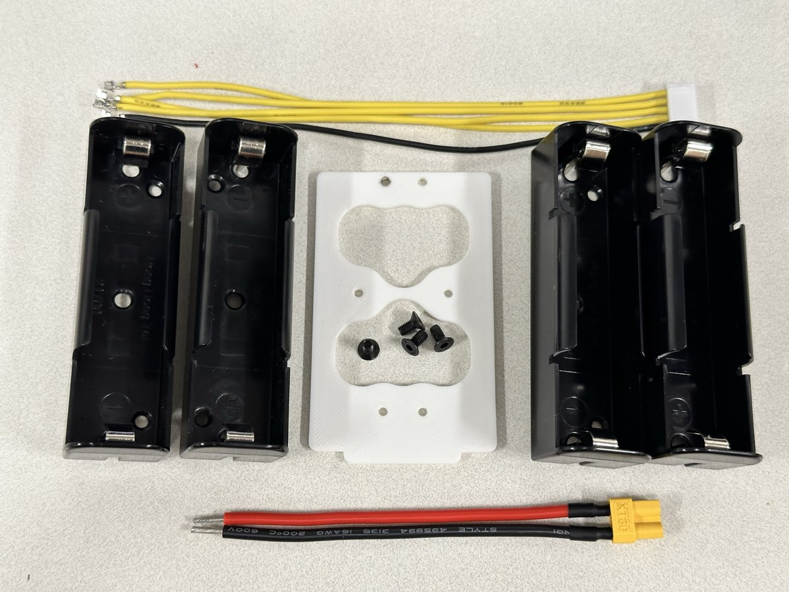

.. _battery:

DIY Battery Assembly
=====================

This guide will walk you through assembling your own battery pack for the ToddlerBot using off-the-shelf components. DIY battery is no required, but it will provide you double the endurance with the same weight. It's not complicated, just needs to be careful, so we prepared a rather long and detailed guide to help you out.

.. warning::
   **Safety First!** Working with batteries can be dangerous. Always:
   
   - Work in a well-ventilated area, know where is the closest fire extinguisher
   - Use proper tools and safety equipment
   - Double-check polarity before making connections
   - Never short circuit battery terminals
   - Keep batteries away from metal objects
   - If you need to remove a cell, use a plastic tab on the side to make it easier to remove. **Never use a metal object to pry the cells out.**

Required Components
-------------------------

Before starting, ensure you have all the necessary components:

- 4x 21700 battery holders (or 2x 2-cell holders)
- 1x 3D-printed battery bracket (white part shown in images)
- 1x XT30 connector (female) with pre-soldered wires
- 1x JST-XH balance connector kit
- 4x M3x4 flat head screws
- Electrical tape or heat shrink tubing
- Soldering equipment and solder

.. note::
   Always keep in mind:

   * The battery/power source terminal should use **female** connector (to prevent accidental short circuit). And passive side should use **male** connector.
   * Positive terminal should use **red** wire, and negative terminal should use **black** wire.
   * If you are not sure, check the voltage.

.. note::
   Some quick tips:

   * High temperature and fast action can significantly increase your rate of success. Do not apply continuous heat for too long. Usually we use 350-400C and leaded solder (try not to use lead-free solder, they require even higher temperature).
   * Have a fan to suck away the fumes.

Step 1: Prepare the Balance Connector Cable and Gather All Components
-----------------------------------------------------------------------

Start by preparing your balance connector cable. This cable will monitor individual cell voltages for safe charging. Insert the cable into each position, note the little clip should be facing the opening of the plastic connector to prevent it from falling out.

The balance connector should use:

- 1x black wire (ground)
- 4x yellow wires (1 for each cell voltage monitoring)
- 1x 5-pin JST-XH connector

Lay out all your components to ensure you have everything needed:

You should have:

- 4x dual 18650 battery holders (or 2x 2-cell holders)
- 1x 3D-printed white bracket with mounting holes
- Pre-wired XT30 connector (red and black wires)
- Balance connector cable
- M3x4 flat head screws

Step 2: Prepare the Battery Holder Terminals
------------------------------------------------

Before assembly, we need to bend **one of the tab** of **each** battery holder, bend 2 of positive side, and 2 of negative side. 90 degrees bend, no protruding edges, be gentle.

Step 3: Assemble the Frame
--------------------------------------------

Screw on the battery holders to the frame with the M3x4 flat head screws. Note the polarity of the holder, **positive+ side on the top left, and negative- side on the top right**.

.. image:: ../_static/battery_pics/IMG_7278.jpg
   :alt: Two battery holders connected together
   :align: center
   :width: 80%

Do the same for the back side with same order, again **positive+ side on the top left, and negative- side on the top right**. Look at the bottom, you should have two straight tabs nicely overlapping together.

Now you can tape the balance leads to the right side of the battery, point the ground lead to the left.

Step 4: Solder the Series Connections
--------------------------------------

Connect the battery holders to create a 4S configuration. Use a small strip of high quality 18awg silicone wire. Solder together two bent leads of the top back side. Note the order! Now is a good time to check if your battery looks **exactly** the same as the picture. Use a tweezer to hold the wire when soldering.

Connect the bottom two tabs together with a little bit of solder between them. Check visually and make sure there are solder between the tabs!

.. warning::
   Double-check your connections! Incorrect wiring can damage the batteries or create a safety hazard. Make sure now the frames form a single series connection, no shorts or parallel connection. Each positive is connected to the negative of the next cell.

Step 5: Solder on the Main Power Cable
--------------------------------------

Bend the cable a bit for it to fit. Pre-apply some solder to the tip. The XT30 connector provides the main power output.

- Red wire: Positive terminal (connects to positive of first cell)
- Black wire: Negative terminal (connects to negative of last cell)

Similarly, apply some solder to the top of the metal clip of the battery holder. You might need to rub the solder iron against the metal clip to get some healthy amount of solder to stick to it. Don't apply heat too long, or plastic will start to melt. I highly recommand using a higher temperature and do it quickly.

Now finally, solder the XT30 power cables to the battery pack:

- Red wire to the positive terminal of the first cell
- Black wire to the negative terminal of the last cell

Step 6: Solder the Balance Connector
-------------------------------------

The balance connector monitors each cell voltage individually. The black ground lead is going to be on the same metal piece as the main ground. 

.. note::
   It's highly recommended to follow the same order and orientation of the cable as shown in the picture to have a clean final result. 

Connect the balance wires in order:

1. Black wire (Pin 1) - Negative of first cell

2. Yellow wire (Pin 2) - Connection between cells 1-2

3. Yellow wire (Pin 3) - Connection between cells 2-3

4. Yellow wire (Pin 4) - Connection between cells 3-4

5. Yellow wire (Pin 5) - Positive of last cell

Step 7: Installing the Cells to the Battery
--------------------------------------------

.. danger::
   **Never skip testing!** An improperly wired battery pack can cause fire, explosion, or equipment damage.

   * Insert cells matching the polarity markings
   * Test for XT30 plug voltage and balance lead voltage after installing each cell
   * Ensure cells are from the same batch and capacity
   * Never mix old and new cells
   * Never use a metal object to pry the cells out.

The frame is now ready to accept the cells. Install the cells one by one, check voltage of the battery after each cell to make sure they are correctly installed. And then proceed to the next cell. The polarity is shown in the picture below for your reference. Please be careful around the positive terminal, 21700 cells have it very close around the ground (case). Never use a metal object around it.

First cell in, XT30 should read ~4V, and only pin2 have voltage ~4V against ground.

Two cells in, XT30 should read ~8V, and pin3 should have voltage ~8V against ground.

Three cells in, XT30 should read ~12V, and pin4 should have voltage ~12V against ground.

Four cells in, XT30 should read ~16V, and pin5 should have voltage ~16V against ground.

Four balance leads should have monotonically increasing voltage against ground. Swap the leads if not.

Now you should put electrical tape to secure the wires and prevent accidental short circuit. We don't recommend using heat shrink tubing, as it requires heat when applying and prevents you from removing cells if needed. If you ever need to remove a cell, you can use a plastic tab on the side to make it easier to remove.

**The finished pack should have:**

- 4S configuration (14.8V nominal, 16.8V fully charged)
- XT30 connector for main power output, max rated discharge rate 25A.
- 5-pin balance connector for safe charging.

And it should look somewhat like this:

.. image:: ../_static/battery_pics/IMG_4324.jpg
   :alt: Finished battery pack
   :align: center
   :width: 80%

Charging Your Battery Pack
--------------------------------

Always use a proper 4S LiPo balance charger:

- Connect both the XT30 and balance connector
- Set charger to 4S LiPo mode
- Use appropriate charge current (typically 0.5C-1C, so 2.5A-5A are usually fine)
- Monitor temperature during charging.
- Store at 3.8V per cell when not in use (total 15.2V).

Congratulations! You've successfully built a DIY battery pack for your ToddlerBot!