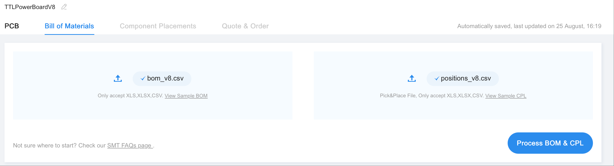

.. _pcb_8ch:

PCB (8ch) Sourcing
=================

We have organized the PCB files in a way that you can just throw into `JLC PCB <https://jlcpcb.com/>`_ and order them. (Recommended to use Chrome to order as Safari sometimes has issues)

PCB Order Options
--------------------------

When you log into JLC PCB, you will see the option to upload the files, drop in the :download:`PCB ZIP files <../_static/TTLPowerBoardV8.zip>`. 

There is no need to change anything in the PCB order options. You can double check the options as shown in the image below. Feel free to change the color to your liking.

.. note::
   You can remove mark if you don't want order number printed on the PCB.

.. note::
   Select the assembly options as shown in the image below. Specifically, use Standard PCBA, assemble both sides, and order 5 pcs so that you have some extra lying around. 
   You can certainly order 2 pcs if budget is tight, but keep in mind that the final price doesn't differ much since it's mostly setup fees. **This is a good time to grab some coupons**

PCB Assembly BOM and CPL
----------------------------

When you click next, you will be prompted to upload your BOM and CPL file. Use these, drop them in the upload section, alternatively, you can find them in the ZIP file too:

- :download:`BOM - bom.csv <../_static/bom_v8.csv>`
- :download:`CPL - positions.csv <../_static/positions_v8.csv>`

Parts Confirmation
----------------------------

You will probably see the parts confirmed automatically. **Make sure to check all the parts in the Seelct column.** Or they will not be assembled. Likely evereything is in stock. If not, try to replace them with the similar parts.

As an example, the picture shows some part that are not in stock. In this case, JST EH plug, 2x06P pin socket, and terminal block are not in stock. You should click on the part that is not in stock, and select the similar part. For example, JST EH plug have an alternative part number ``C160259``.

Similarly, for 2x06P pin socket, a common replacement part is ``C2902689``.

And for the terminal block, you can pretty much replace it with any 2 pin 5mm spacing terminal block, search for ``terminal block 5mm`` on JLC. e.g. ``C5188440``.

Now you should see the parts nicely placed on the PCB, they should appear EXACTLY the same as shown in the picture. If not, correct them to as shown in the image below, make sure all the parts are placed correctly.

Finalize the Order
----------------------------

.. note::
   You might notice the price is very different from what's shown in the picture, depending on tariff.
   
You can now finalize the order. You will see the final price, and you can proceed to pay.

.. .. note::
..     Finally, if you would like to tinker with the PCB, here is the kicad file:
..     :download:`TTLPowerBoardV3.1.kicad_pcb <../_static/TTLPowerBoardV3.1.kicad_pcb>`